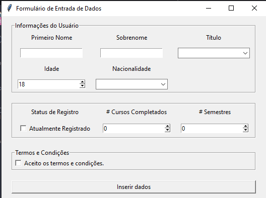

# Tkinter Interface

Este projeto consiste em duas aplicações simples desenvolvidas em Python utilizando a biblioteca Tkinter para criar interfaces gráficas. Uma das aplicações é um formulário de entrada de dados, enquanto a outra é um formulário de entrada de dados, a biblioteca pyinstaller também foi implementada para poder gerar arquivo executavel .exe dos codigos.

## Logo

#### Login

  

#### Formulário

  

## Sumário

- [Tecnologias Utilizadas](#tecnologias-utilizadas)
- [Status](#status)
- [Descrição](#descrição)
- [Funcionalidades](#funcionalidades)
- [Como Usar](#como-usar)
- [Estrutura do Projeto](#estrutura-do-projeto)
- [Autor](#autor)

## Tecnologias Utilizadas

  

    
  

## Status

<!-- -->

## Descrição

Este repositório contém duas aplicações desenvolvidas em Python com Tkinter: um formulário de entrada de dados e um formulário de entrada de dados.

## Funcionalidades

- Formulário de entrada de dados com validação de termos e condições.

## Como Usar

1. Clone este repositório para o seu ambiente local.
2. Abra o terminal ou prompt de comando.
3. Navegue até o diretório do projeto.
4. Execute o arquivo "main.py" para abrir o formulário de entrada de dados.

**5. Use os comando para criar o arquivo executável dos códigos com pyinstaller:**

1. pip install pyinstaller
2. cd tkinter_python_interface
3. pyinstaller formulario.py --onefile -w

Para poder criar um unico arquivo executavel.

## Estrutura do Projeto

- `login.py`: Script principal para o formulário de entrada de dados.
- `Formulário.py`

## Autor

Desenvolvido por Diego Franco.
